<div align="center">

# 📋 SmartSurvey

**Design smart surveys with conditional logic, collect responses anywhere, and turn them into beautiful, exportable reports.**

[](https://github.com/supunsarachitha/SmartSurvay/actions/workflows/ci.yml)


[](LICENSE.md)

ASP.NET Core 8 · Blazor (Interactive Server) · EF Core 8 · PostgreSQL · QuestPDF

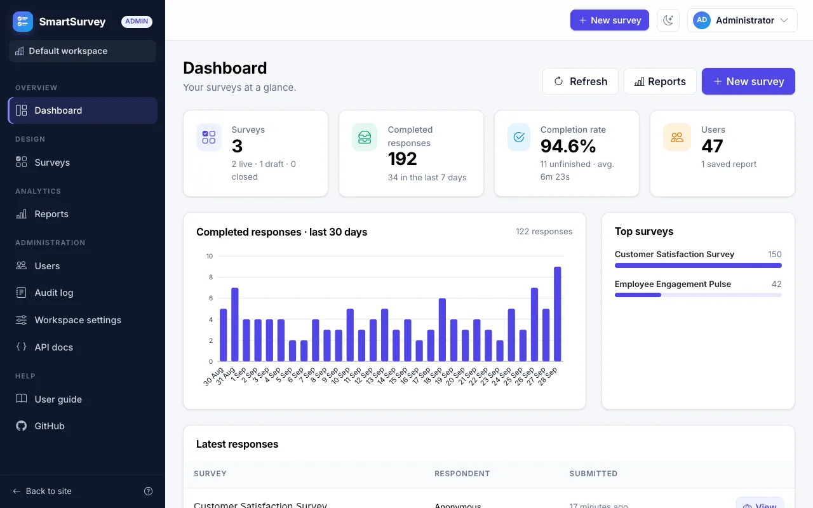

</div>

---

## ✨ Highlights

- **Workspaces** — one installation hosts many fully isolated workspaces, each with its own admins, members, surveys,
  responses and reports. Anyone can create a workspace at `/signup` (optionally with approval) and invite people with
  a join link.
- **System console for super admins** — create, approve, disable, enable and delete workspaces, manage every account,
  the branding and the system settings, without seeing any workspace's content.
- **Survey builder** — 10 question types (text, paragraph, radio, checkbox, dropdown, number, e-mail, date, star rating,
  linear scale/NPS), answer options, combined *"Other → free text"* options, multi-page sections, per-question settings.
- **Conditional logic** — show/hide questions and whole pages based on earlier answers (10 operators, All/Any),
  evaluated live in the browser and re-validated on the server.
- **Great respondent experience** — mobile-friendly runner, progress bar, live validation, auto-saved drafts with
  resume, anonymous links, QR codes and embedding in any website.
- **Password-protected links** — optionally require a password to open a survey (stored as a salted hash, enforced
  on the server for opening, saving and submitting).
- **Bot & spam protection** — invisible proof-of-work challenge, minimum answering time, honeypot field, one-time
  challenges and rate limits; no CAPTCHA, no third-party service.
- **Encryption at rest** — respondents' written answers, "Other" texts and browser details are encrypted in the
  database (ASP.NET Core Data Protection, AES-256); the keys are stored outside the database. Passwords are only
  stored as hashes.
- **Dynamic reports** — KPIs, distribution tables, bar/pie/doughnut/line charts, cross-tabs, NPS, text answers and raw
  grids with date and answer filters, live preview, and **PDF / CSV / TXT / Excel / JSON** export.
- **Administration** — per workspace: dashboard, response browser, member & role management (incl. password reset),
  audit log and workspace settings; system-wide branding (product name, tagline, logo) in the System console.
- **Built-in user guide** — step-by-step help for non-technical users at `/guide`.
- **REST API** — every capability over `/api/v1` with bearer tokens, Swagger and ProblemDetails.
- **Production-ready** — Clean Architecture, FluentValidation, SMTP account e-mails, rate limiting, security headers,
  health checks, dark mode, Docker, CI, 900+ automated tests.

## 📸 Screenshots

| | |
|:---:|:---:|
| 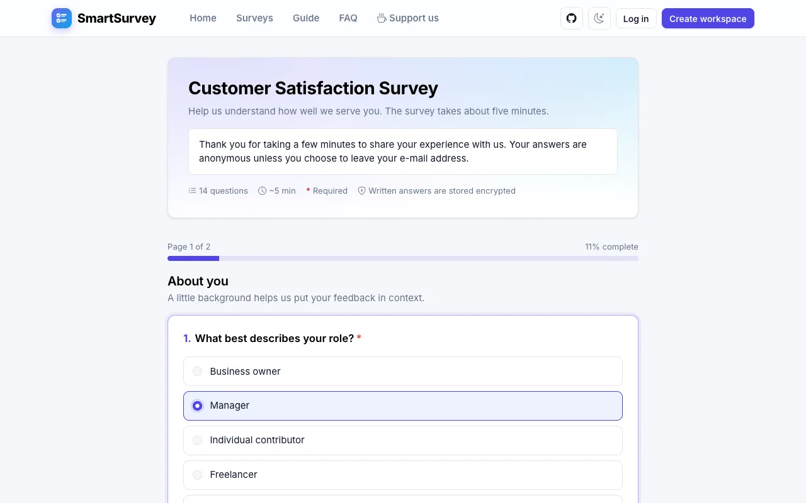<br/>**Answering a survey** — progress bar, required markers, live validation | 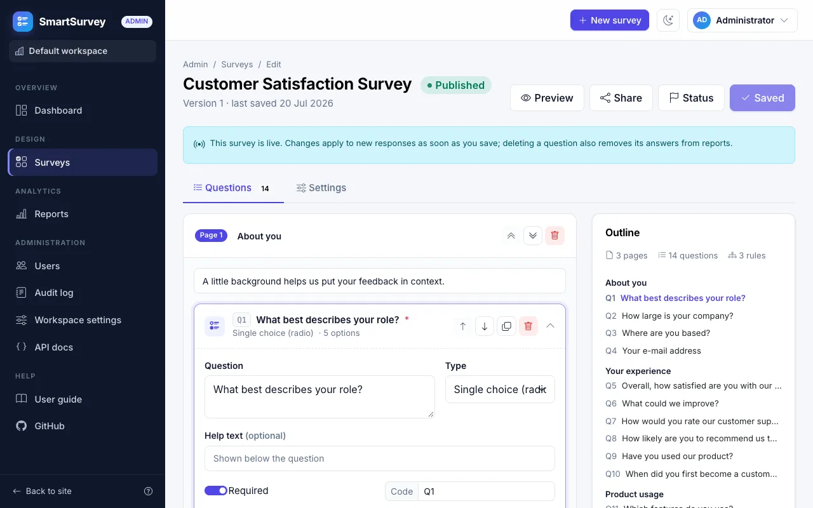<br/>**Survey builder** — pages, questions, options and an outline |
| 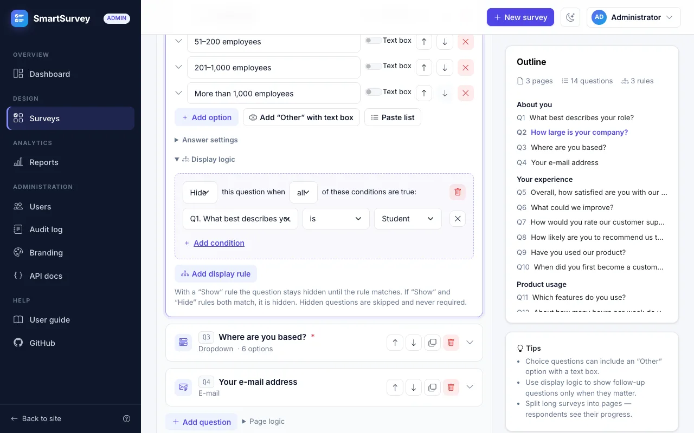<br/>**Display logic** — show or hide questions based on earlier answers | 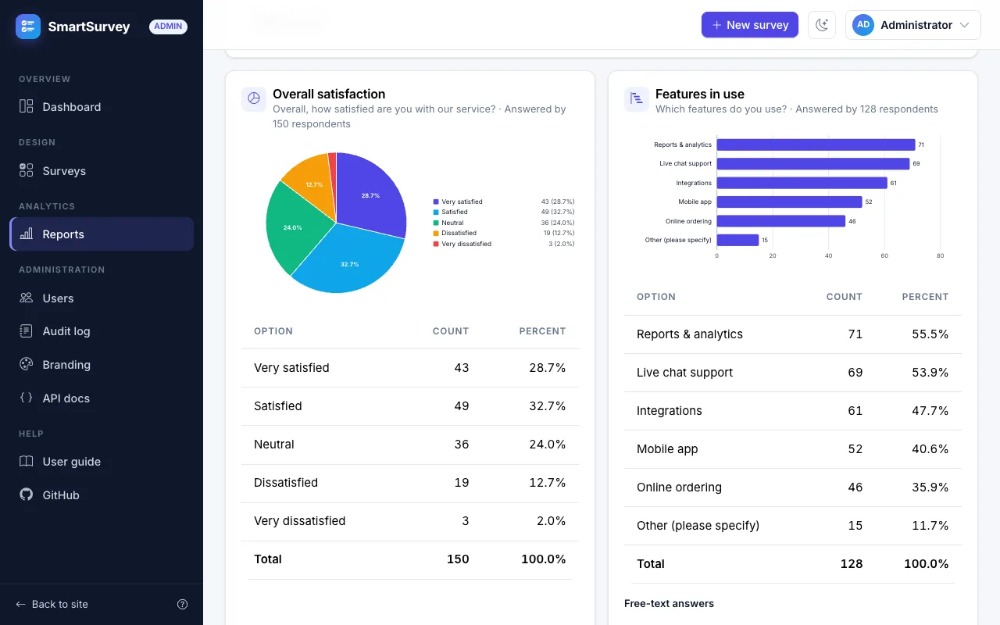<br/>**Reports** — charts and tables from live data, exportable as PDF/Excel |
| 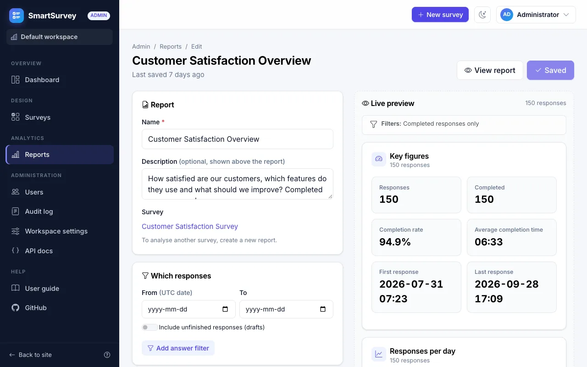<br/>**Report builder** — widgets and filters with a live preview | 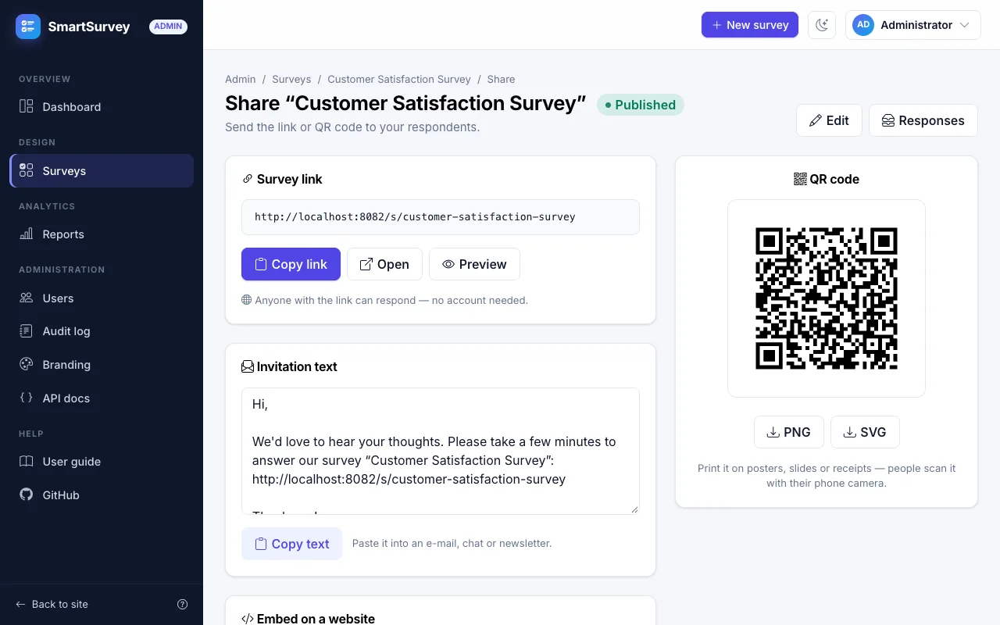<br/>**Sharing** — link, QR code, invitation text and website embed |
| 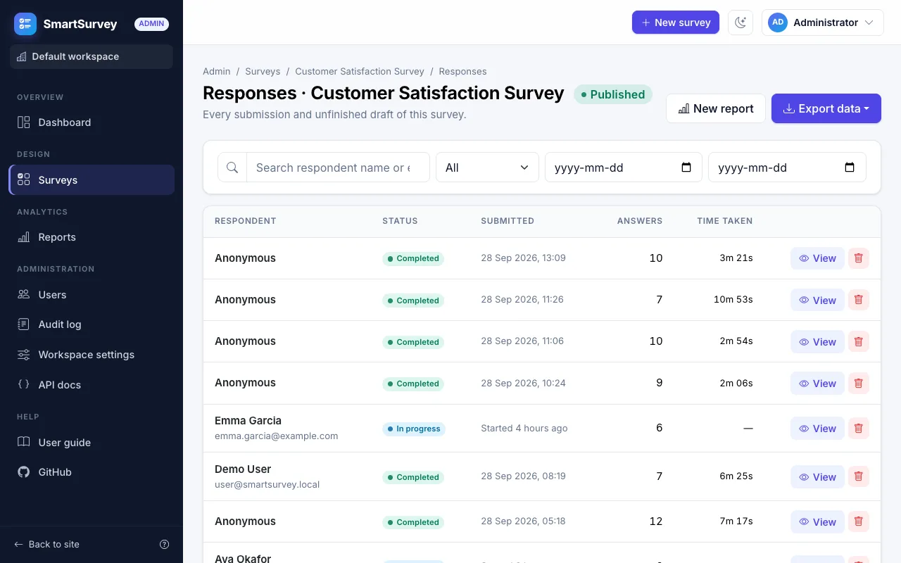<br/>**Responses** — filter, open, delete and export raw data | 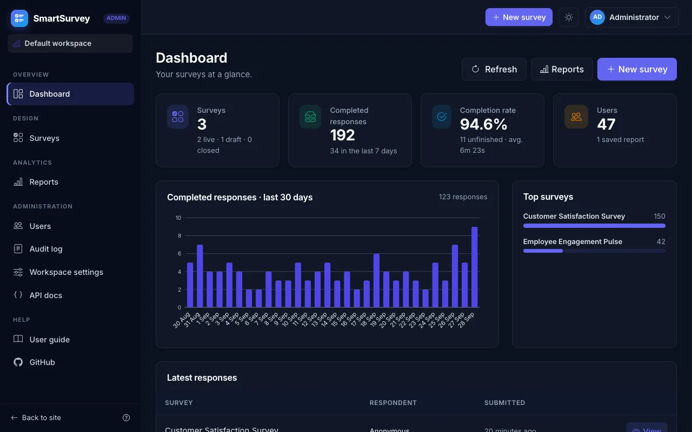<br/>**Dark mode** — every page, remembered per browser |
| 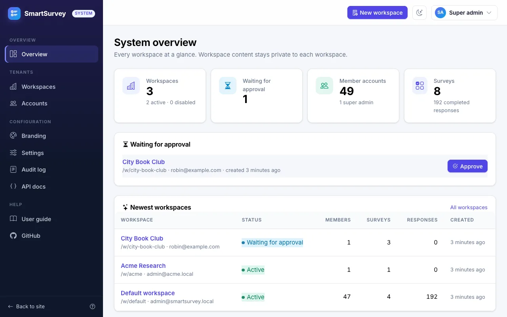<br/>**System console** — super admins approve, disable and manage workspaces | 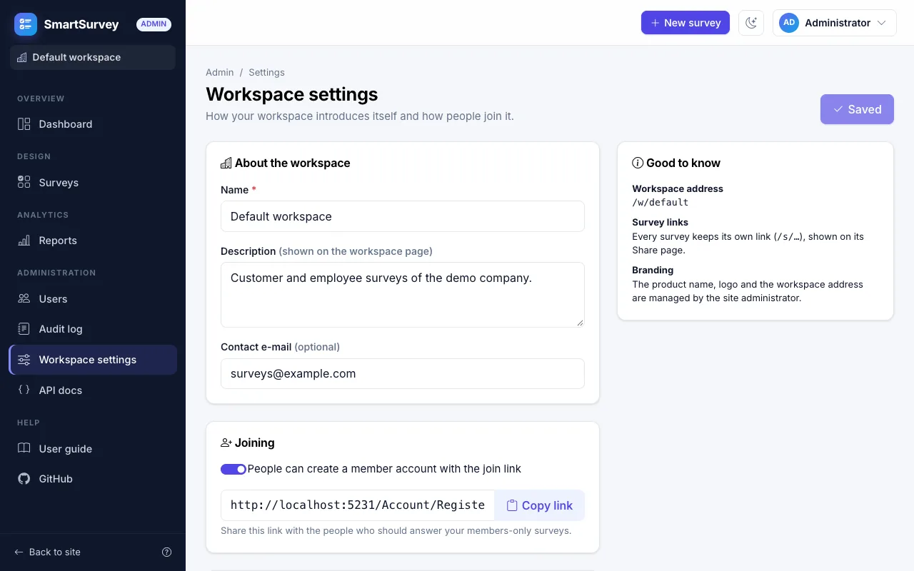<br/>**Workspaces** — each with its own admins, members and join link |
| 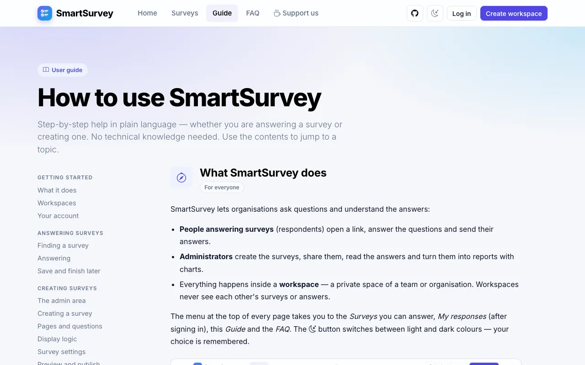<br/>**User guide** — plain-language help inside the app | 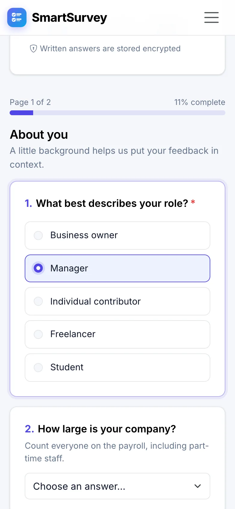<br/>**Mobile** — surveys work on any device |

## 🐳 Run with Docker (recommended)

The easiest way to run SmartSurvey — you only need **Docker**. The stack contains the web app and a PostgreSQL 16
database; data is kept in Docker volumes, so it survives restarts.

### 1. Install Docker

- **Windows / macOS:** install [Docker Desktop](https://www.docker.com/products/docker-desktop/) and start it.
- **Linux:** install [Docker Engine](https://docs.docker.com/engine/install/) with the Compose plugin.

Check that it works: `docker compose version`.

### 2. Get the code

```bash
git clone https://github.com/supunsarachitha/SmartSurvay.git
cd SmartSurvay
```

### 3. (Optional) Choose your settings

```bash
cp .env.example .env      # Windows PowerShell: copy .env.example .env
```

Open `.env` and at least change `ADMIN_PASSWORD` and `POSTGRES_PASSWORD`. Without a `.env` file the defaults below
are used.

### 4. Start SmartSurvey

```bash
docker compose up -d --build
```

The first start takes a few minutes (Docker downloads the base images and builds the app). Later starts take seconds.

### 5. Open the app

Go to **<http://localhost:8080>** and sign in with:

| Account | E-mail | Password |
|---|---|---|
| Admin of "Default workspace" | `admin@smartsurvey.local` | `ChangeMe123!` (or your `ADMIN_PASSWORD`) |
| Super admin (System console `/system`) | `superadmin@smartsurvey.local` | `ChangeMe123!` (or your `SUPERADMIN_PASSWORD`) |

With `DEMO_DATA=true` (the default) you also get example surveys, ~200 responses, a sample report, a demo
respondent `user@smartsurvey.local` / `User123!` and a second workspace "Acme Research" (`admin@acme.local`, admin
password) that cannot see anything of the first one. The in-app **Guide** (<http://localhost:8080/guide>) explains
every feature step by step.

> These e-mails and passwords are only used the **first time** (when the accounts don't exist yet). Change the
> passwords right after signing in with *Account settings* (or *Users → Set new password*).

> ⬆️ **Upgrading from 1.x?** Your existing surveys, responses and accounts move into "Default workspace" automatically;
> survey links stay the same. Set `SUPERADMIN_PASSWORD` to get a super admin. Back up the database and the `keys`
> volume first.

> 🔐 **Keep the `keys` volume safe.** It holds the keys that decrypt respondents' written answers (and keeps people
> signed in). Back it up **together with** the database — a database backup without its keys contains unreadable
> answers. `docker compose down -v` deletes both.

### Everyday commands

| What | Command |
|---|---|
| See status | `docker compose ps` |
| Follow the app's log | `docker compose logs -f web` |
| Stop (keeps your data) | `docker compose stop` |
| Start again | `docker compose start` |
| Update to the latest code | `git pull && docker compose up -d --build` |
| Check that everything works | `scripts/container-smoke.sh http://localhost:8080 admin@smartsurvey.local 'ChangeMe123!' superadmin@smartsurvey.local 'ChangeMe123!'` |
| Back up the database | `docker compose exec -T db pg_dump -U smartsurvey smartsurvey > backup.sql` |
| Back up the **encryption keys** (always together with the database!) | `docker compose cp web:/app/keys ./keys-backup` |
| Restore a backup | `docker compose exec -T db psql -U smartsurvey smartsurvey < backup.sql` |
| Restore the keys (before starting on a new machine) | `docker compose cp ./keys-backup/. web:/app/keys && docker compose restart web` |
| Remove everything **including all data** | `docker compose down -v` |

### Settings (`.env`)

| Variable | Default | Meaning |
|---|---|---|
| `ADMIN_EMAIL` / `ADMIN_PASSWORD` | `admin@smartsurvey.local` / `ChangeMe123!` | First workspace admin (created with "Default workspace" on an empty database) |
| `SUPERADMIN_EMAIL` / `SUPERADMIN_PASSWORD` | `superadmin@smartsurvey.local` / `ChangeMe123!` | First super admin (created when none exists) |
| `PUBLIC_BASE_URL` | *(empty)* | Public address of the site (e.g. `https://surveys.example.com`) for links in e-mails, share links and QR codes |
| `ALLOWED_HOSTS` | `*` | Host name(s) of the site — set it on a server |
| `POSTGRES_PASSWORD` | `smartsurvey` | Database password |
| `WEB_PORT` | `8080` | Port of the website on your computer |
| `POSTGRES_PORT` | `5432` | Port of the database on your computer (change it if 5432 is taken) |
| `DEMO_DATA` | `true` | Example surveys, responses and a report — set `false` for real use |
| `SWAGGER_ENABLED` | `true` | API documentation at `/swagger` |
| `SMTP_HOST`, `SMTP_PORT`, `SMTP_SECURITY`, `SMTP_USERNAME`, `SMTP_PASSWORD`, `MAIL_FROM` | *(off)* | E-mail server for password-reset and confirmation e-mails |
| `BOT_PROTECTION` | `true` | Spam/bot checks for anonymous responses |
| `ENCRYPTION` | `true` | Encrypt respondents' written answers in the database (keys in the `keys` volume) |
| `BMC_USERNAME` / `GITHUB_URL` | project defaults | Links on the support page and in the footer |

### Putting it on a server

Run the same stack on a server and put a reverse proxy with HTTPS (for example Caddy, nginx or Traefik) in front of
port 8080. Before going live: set strong passwords, `DEMO_DATA=false`, `PUBLIC_BASE_URL`, `ALLOWED_HOSTS`, decide on `SWAGGER_ENABLED`
and on self-service sign-up (System → Settings), configure e-mail and back up the database regularly. The full checklist is in
[DOCUMENTATION.md § Deployment](docs/DOCUMENTATION.md#19-deployment).

**Troubleshooting:** *port is already allocated* → change `WEB_PORT` / `POSTGRES_PORT`; *admin login fails* → the
database already existed with another password (see the note above, or `docker compose down -v` to start fresh);
more in [DOCUMENTATION.md § Troubleshooting](docs/DOCUMENTATION.md#21-troubleshooting).

## 💻 Run for development (without Docker)

```bash
# Prerequisites: .NET 8 SDK + PostgreSQL 16 (native, or just the database: `docker compose up -d db`)
dotnet tool restore
dotnet run --project src/SmartSurvey.Web
```

Open <https://localhost:7047> and sign in with **admin@smartsurvey.local / Admin123!** (workspace admin) or
**superadmin@smartsurvey.local / SuperAdmin123!** (System console). Development seed data includes example surveys,
~200 responses, a sample report and the second workspace "Acme Research" (`admin@acme.local` / `Admin123!`). API docs:
`/swagger`.

No PostgreSQL? Run with SQLite:

```bash
Database__Provider=Sqlite ConnectionStrings__DefaultConnection="Data Source=smartsurvey.db" \
  dotnet run --project src/SmartSurvey.Web
```

(PowerShell: `$env:Database__Provider="Sqlite"; $env:ConnectionStrings__DefaultConnection="Data Source=smartsurvey.db"`.)

## 🧱 Architecture

```
src/SmartSurvey.Domain          entities, enums, value objects
src/SmartSurvey.Application     services, DTOs, validation, conditional logic, report engine, SVG charts
src/SmartSurvey.Infrastructure  EF Core (PostgreSQL/SQLite), migrations, exporters, Identity, e-mail, seeding
src/SmartSurvey.Web             Blazor UI + Minimal API + Identity
tests/                          unit (xUnit, bUnit, SQLite) and integration (WebApplicationFactory) tests
```

The Blazor UI and the REST API share one Application layer, so business rules are implemented exactly once.

## 📚 Documentation

- **In-app user guide** — `/guide`: how to answer surveys and how to create, share and analyse them (non-technical)
- **[docs/DOCUMENTATION.md](docs/DOCUMENTATION.md)** — complete technical documentation (architecture, schema,
  logic semantics, reporting, exports, API, configuration, security, testing, deployment, extending)
- **[docs/examples](docs/examples)** — API examples (`.http` file, survey/response/report JSON payloads)
- **[CHANGELOG.md](CHANGELOG.md)** — release notes
- **[DEVELOPMENT_PLAN.md](DEVELOPMENT_PLAN.md)** — the phased development plan and progress log

## 🧪 Tests

```bash
dotnet test                                                       # unit + integration tests
bash scripts/smoke.sh --user admin / /admin /admin/surveys /admin/reports
scripts/container-smoke.sh http://localhost:8080                  # against a running container stack
```

## ☕ Support

If SmartSurvey saves you time, consider [buying me a coffee](https://buymeacoffee.com/jkhy9gtjs) ☕ — or visit the
in-app **Support us** page. Found a bug or have an idea? [Open an issue](https://github.com/supunsarachitha/SmartSurvay/issues).

## 📄 License

SmartSurvey is **source-available for non-commercial use** under the
[PolyForm Noncommercial License 1.0.0](LICENSE.md):

- ✅ Free for personal use, study, research, hobby projects and non-commercial organizations (charities, schools,
  public institutions).
- ❌ Commercial use — selling it, offering it as a paid or ad-supported service, or using it to run a business —
  requires a separate commercial license.
- 👤 The repository owner, [Supun (supunsarachitha)](https://github.com/supunsarachitha), keeps all rights, including
  commercial use, and can grant commercial licenses — get in touch via GitHub.

Third-party libraries keep their own licenses; notably [QuestPDF](https://www.questpdf.com/) is used under its
Community license. See [DOCUMENTATION.md § Licensing notes](docs/DOCUMENTATION.md#22-licensing-notes).
