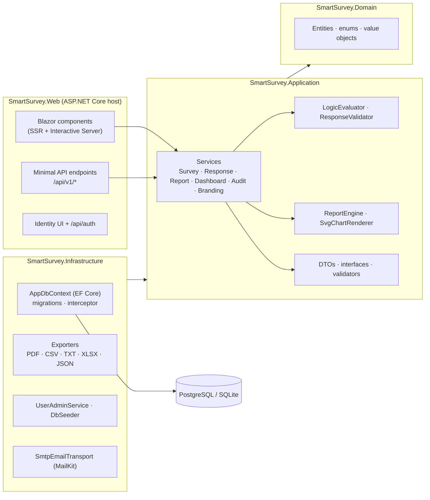
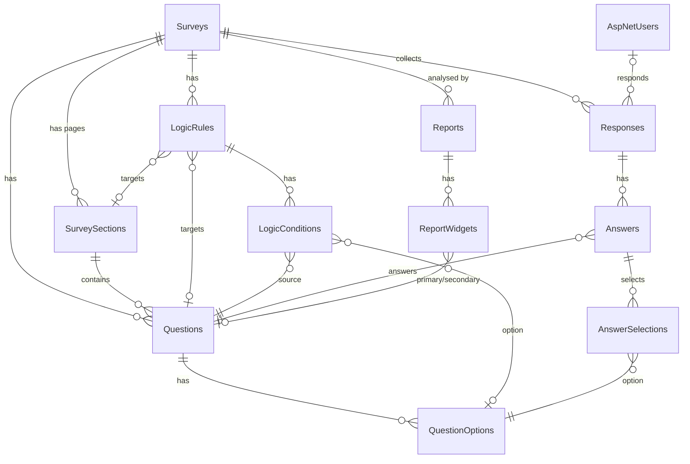

# SmartSurvey — Technical & User Documentation

> Version 1.0 · ASP.NET Core 8 · Blazor (Interactive Server) · EF Core 8 · PostgreSQL 16
>
> This is the single reference document for SmartSurvey: what it does, how it is built, how to run,
> configure, extend, test and deploy it. The development history lives in
> [`CHANGELOG.md`](../CHANGELOG.md) and the build plan in [`DEVELOPMENT_PLAN.md`](../DEVELOPMENT_PLAN.md).

---

## Table of contents

1. [Overview](#1-overview)
2. [Feature list](#2-feature-list)
3. [Technology stack](#3-technology-stack)
4. [Getting started](#4-getting-started)
5. [Architecture](#5-architecture)
6. [Project structure](#6-project-structure)
7. [Data model & database schema](#7-data-model--database-schema)
8. [Database migrations](#8-database-migrations)
9. [Designing surveys](#9-designing-surveys)
10. [Conditional logic](#10-conditional-logic)
11. [Collecting responses](#11-collecting-responses)
12. [Reporting](#12-reporting)
13. [Exports](#13-exports)
14. [REST API](#14-rest-api)
15. [User interface guide](#15-user-interface-guide)
16. [Security](#16-security)
17. [Configuration reference](#17-configuration-reference)
18. [Testing](#18-testing)
19. [Deployment](#19-deployment)
20. [Extending SmartSurvey](#20-extending-smartsurvey)
21. [Troubleshooting](#21-troubleshooting)
22. [Licensing notes](#22-licensing-notes)

---

## 1. Overview

SmartSurvey is a self-hosted, full-stack survey platform:

* **Administrators** design surveys with ten question types, answer options, combined
  *"Other → free text"* options, multi-page layouts and **conditional show/hide logic**; they publish,
  schedule, share (link, QR code, embed) and close surveys, browse individual responses and build
  **dynamic reports** — tables and charts over live data — that can be exported as **PDF, CSV, TXT,
  Excel (XLSX) and JSON**.
* **Respondents** answer surveys in a clean, mobile-friendly runner with live branching, per-page
  validation, a progress bar and **save & resume** drafts. Surveys can be public (anonymous link) or
  require an account.
* **Integrators** use the same capabilities through a documented **REST API** secured with bearer tokens.

All business rules live in one Application layer that is shared by the Blazor UI and the REST API, so
both behave identically.

## 2. Feature list

| Area | Capabilities |
|---|---|
| Survey design | 10 question types (short text, long text, radio, checkbox, dropdown, number, e-mail, date, star rating, linear scale/NPS); answer options with export values; *"Other (please specify)"* free-text options; required flags; help texts; per-type settings (placeholders, length limits, min/max values, whole numbers, min/max selections, rating size, scale range and labels, date range, randomised options); multi-page sections; question codes for exports |
| Logic | Show/hide rules for questions **and** sections; conditions on earlier answers with 10 operators; All/Any matching; chained logic; server-side re-evaluation |
| Lifecycle | Draft → Published → Closed → Archived; reopen; schedule (opens/closes at); response quota; templates; duplicate; JSON import/export of survey definitions; optimistic concurrency |
| Distribution | Public link `/s/{slug}`, QR code, invitation text, embedding in other websites (`/embed/s/{slug}` + snippet), anonymous or login-required surveys, one-response-per-user option |
| Responding | Multi-page runner, progress bar, live branching, per-page and final validation (errors clear as answers are fixed), per-respondent option shuffling, drafts with auto-save and resume for logged-in users, thank-you page, "My responses", admin preview (desktop/phone) |
| Responses | Filterable, paged response browser; response detail; deletion; raw export (CSV/XLSX/JSON) |
| Reports | Saved report definitions per survey; global filters (date range, drafts, answer-based filters with All/Any); 10 widget types (KPIs, question tables, bar/horizontal bar/pie/doughnut charts, responses-over-time line chart, cross-tabulation, text responses, raw grid); numeric statistics incl. NPS; auto-generated default report; live preview builder |
| Exports | PDF (QuestPDF, charts embedded as SVG), CSV (RFC 4180, Excel-friendly, CSV-injection safe), TXT (ASCII tables + text bar charts), XLSX (ClosedXML, one sheet per widget), JSON |
| Administration | Dashboard (KPIs, 30-day trend, top surveys, recent responses), user management (create, roles, set password, lock/unlock, delete with self-protection), audit log, branding (product name, tagline, icon or logo/favicon) |
| Platform | ASP.NET Core Identity (cookie + bearer tokens, lockout, 2FA pages), account e-mails over SMTP, role policies, ProblemDetails errors, rate limiting, security headers, health checks, Swagger/OpenAPI, dark mode, responsive UI, Docker, CI |
| Extras | FAQ page, Buy Me a Coffee support page with QR code |

## 3. Technology stack

| Concern | Technology |
|---|---|
| Runtime | .NET 8 (LTS) / ASP.NET Core 8 — `net8.0`, SDK pinned in `global.json` |
| UI | Blazor Web App: static SSR by default, **Interactive Server** for rich pages |
| Styling | Bootstrap 5.3.8, Bootstrap Icons 1.13.1, Inter variable font — all self-hosted in `wwwroot/lib` |
| ORM | Entity Framework Core 8.0.31 |
| Database | PostgreSQL 16 via Npgsql 8.0.11 (primary); SQLite (demos & tests) |
| Identity | ASP.NET Core Identity with GUID keys; cookie auth (UI) + Identity bearer tokens (API) |
| Validation | FluentValidation 12 |
| PDF | QuestPDF 2026.9 (Community license) |
| Excel | ClosedXML 0.105 |
| QR codes | QRCoder 1.8 |
| E-mail | MailKit 4.18 (SMTP) |
| API docs | Swashbuckle 10 (OpenAPI) |
| Tests | xUnit 2.9, bUnit 2.11, `WebApplicationFactory` (DI scope validation on), SQLite in-memory |
| DevOps | Dockerfile, docker-compose, GitHub Actions |

> ⚠️ **.NET 8 support ends on 10 November 2026.** The target framework is defined once in
> `Directory.Build.props` (and the SDK in `global.json`), so moving to .NET 10 LTS is a small change:
> update both, bump the `8.0.*` Microsoft packages in `Directory.Packages.props` to `10.0.*`, rebuild and
> run the tests.

## 4. Getting started

### 4.1 Prerequisites

* .NET 8 SDK (8.0.4xx) — <https://dotnet.microsoft.com/download>, `winget install Microsoft.DotNet.SDK.8` (Windows),
  `brew install --cask dotnet-sdk@8` (macOS) or your Linux distribution's `dotnet-sdk-8.0` package
* PostgreSQL 16 — native install **or** Docker (easiest: `docker compose up -d db`)
* (optional) Docker Desktop / Docker Engine for the container stack

### 4.2 Database

**Native PostgreSQL** (e.g. `winget install PostgreSQL.PostgreSQL.16`, `brew install postgresql@16` or
`apt install postgresql-16`), then create the role and database:

```sql
CREATE ROLE smartsurvey LOGIN PASSWORD 'smartsurvey' CREATEDB;
CREATE DATABASE smartsurvey OWNER smartsurvey;
```

**Docker**: `docker compose up -d db` starts PostgreSQL 16 with the same credentials
(set `POSTGRES_PORT` if 5432 is taken).

### 4.3 Run

```bash
dotnet tool restore                      # installs the local dotnet-ef 8.0.31 tool
dotnet run --project src/SmartSurvey.Web # https://localhost:7047 · http://localhost:5057
```

On start-up the app applies pending migrations and seeds roles, an administrator and — in Development —
demo data (surveys with logic, ~200 responses and a sample report).

| Account (Development) | Password | Role |
|---|---|---|
| `admin@smartsurvey.local` | `Admin123!` | Admin |
| `user@smartsurvey.local` | `User123!` | User |

Swagger UI: `/swagger` · Health: `/health`.

### 4.4 Zero-install demo mode (SQLite)

```bash
# bash / zsh
Database__Provider=Sqlite ConnectionStrings__DefaultConnection="Data Source=smartsurvey.db" \
  dotnet run --project src/SmartSurvey.Web
```

```powershell
# PowerShell
$env:Database__Provider="Sqlite"; $env:ConnectionStrings__DefaultConnection="Data Source=smartsurvey.db"
dotnet run --project src/SmartSurvey.Web
```

SQLite mode creates the schema with `EnsureCreated` (no migrations) and is intended for demos and tests.

### 4.5 Full container stack

```bash
docker compose up --build        # http://localhost:8080  (admin password: ChangeMe123! unless ADMIN_PASSWORD is set)
scripts/container-smoke.sh       # health, pages, admin sign-in and a PDF export against the running stack
```

## 5. Architecture

SmartSurvey follows **Clean Architecture**. Dependencies point inwards; the Web project is the
composition root.



### 5.1 Key design decisions

| Decision | Rationale |
|---|---|
| **One Application layer for UI and API** | Blazor Server components call services in-process; REST endpoints are thin wrappers over the same services — no duplicated rules. |
| **Shared logic & validation code** | `LogicEvaluator` and `ResponseValidator` are pure functions over DTOs. The runner uses them for live branching/validation; `ResponseService` re-runs them on submission (the client is never trusted). |
| **`IAppDbContextFactory`** | Blazor Server DI scopes live as long as a user's circuit; services therefore create a short-lived `DbContext` per operation. |
| **Client-generated GUID keys** | Complete survey graphs (questions referenced by logic rules) can be built in memory — in the builder or by API clients — before the first save. Keys are `ValueGeneratedNever()` so reconciliation marks new entities as *Added*. |
| **UTC `DateTime`, `double` numbers, string enums, JSON settings** | Portable across PostgreSQL and SQLite; settings columns are `jsonb` on PostgreSQL. |
| **Server-side SVG charts** | One renderer produces the charts for the browser *and* for PDFs — identical output, no JavaScript chart library, fully unit-testable, XSS-safe. |
| **Pluggable exporters** | `IReportExporter` implementations are discovered through DI; adding a format is one class + one registration. |
| **Cookie-or-bearer policy scheme** | The default authentication scheme forwards to the bearer handler when an `Authorization: Bearer` header is present, otherwise to the Identity cookie, so `ICurrentUser` works for both UI and API callers. |

### 5.2 Request flows

* **Interactive page** (e.g. survey builder): browser ⇄ SignalR circuit ⇄ Blazor component → service →
  `IAppDbContextFactory` → EF Core → PostgreSQL. `ICurrentUser` is populated by a `CircuitHandler`.
* **Static page** (e.g. FAQ): HTTP request → Razor component rendered once on the server (SSR).
* **REST call**: HTTP request → authentication (cookie or bearer) → `CurrentUserMiddleware` → endpoint →
  service; expected failures become RFC 7807 ProblemDetails in `ApiErrorFilter` (endpoint filter on `/api/v1`),
  anything unexpected in `ApiExceptionHandler` (logged, details hidden outside Development).
* **Survey runner**: the page is prerendered (the session and the option-shuffle seed are handed to the interactive
  render through persisted component state), then answers are edited in `SurveyRunState`, which runs the same
  `LogicEvaluator` / `ResponseValidator` as the server.

## 6. Project structure

```
SmartSurvey.sln
├── src/
│   ├── SmartSurvey.Domain/            Entities (Survey, SurveySection, Question, QuestionOption, LogicRule,
│   │                                  LogicCondition, SurveyResponse, Answer, AnswerSelection,
│   │                                  ReportDefinition, ReportWidget, AuditLogEntry), enums, value objects
│   │                                  (QuestionSettings, WidgetSettings, ReportFilterSet), ApplicationUser
│   ├── SmartSurvey.Application/       Common (exceptions, paging, abstractions, slugs), Surveys, Responses,
│   │                                  Logic, Reports (+Charts), Exports (contracts), Dashboard, Users, Audit
│   ├── SmartSurvey.Infrastructure/    Persistence (AppDbContext, Configurations, Converters, Migrations,
│   │                                  Seed), Exports (PDF/CSV/TXT/XLSX/JSON, raw responses), Identity
│   └── SmartSurvey.Web/               Program.cs, Api/ (endpoints), Infrastructure/ (current user, auth,
│                                      error handling, security headers/embedding, throttle, browser
│                                      interop), Components/ (Layout, Shared, Pages, Admin/Builder,
│                                      Admin/Reports, Runner, Account), wwwroot/
├── tests/
│   ├── SmartSurvey.UnitTests/         Core logic, services (SQLite in-memory), exporters, bUnit components
│   └── SmartSurvey.IntegrationTests/  REST API end-to-end through WebApplicationFactory
├── docs/                              DOCUMENTATION.md (this file), examples/ (API payloads, .http file)
├── scripts/smoke.sh                   Boots the app on SQLite and smoke-tests pages
├── scripts/container-smoke.sh         Smoke-tests a running container stack (incl. PDF export)
├── Dockerfile · docker-compose.yml · .github/workflows/ci.yml
└── Directory.Build.props · Directory.Packages.props · global.json · DEVELOPMENT_PLAN.md · CHANGELOG.md
```

## 7. Data model & database schema



| Table | Purpose | Notable columns / constraints |
|---|---|---|
| `Surveys` | Survey aggregate root | `Slug` (unique), `Status` (string enum), `IsTemplate`, schedule `OpensAt`/`ClosesAt`, `MaxResponses`, `Version` (concurrency token), audit columns |
| `SurveySections` | Pages | `Order`; cascade from survey |
| `Questions` | Questions | `Type`, `Code` (unique per survey, service-enforced), `Settings` (**jsonb**), `IsRequired`, `Order` |
| `QuestionOptions` | Choice options | `AllowsFreeText` ("Other → text"), `Value`, `Order` |
| `LogicRules` / `LogicConditions` | Show/hide logic | exactly one of `TargetQuestionId` / `TargetSectionId`; conditions reference `SourceQuestionId`, `Operator`, `OptionId` or `Value` |
| `Responses` | Submissions & drafts | `RespondentId` (nullable, **SET NULL** on user delete), `Status`, `StartedAt`, `SubmittedAt`, `CurrentSectionIndex` |
| `Answers` | One per question per response | `TextValue` / `NumberValue` (double) / `DateValue` (date); unique (`ResponseId`,`QuestionId`) |
| `AnswerSelections` | Selected options | `FreeText`; unique (`AnswerId`,`OptionId`) |
| `Reports` / `ReportWidgets` | Saved report definitions | `Filters` and `Settings` (**jsonb**); widget question FKs **SET NULL** |
| `AuditLogs` | Audit trail | indexed by `Timestamp` and (`EntityType`,`EntityId`) |
| `BrandingSettings` | Product branding (single row) | `ProductName`, `Tagline`, `IconName`, `LogoContent` (bytes) + content type, `Version` (cache busting) |
| `AspNet*` | ASP.NET Core Identity | GUID keys; `AspNetUsers` adds `DisplayName`, `CreatedAt`, `LastLoginAt`, `IsActive` |

Delete behaviour: deleting a survey cascades to its design, responses and reports; deleting a question
cascades to its answers (the builder warns before doing so); deleting a user keeps their responses
(anonymised).

Conventions (see `AppDbContext`): all `DateTime` values are stored/read as UTC; enums are stored as
strings (max 40); settings objects use a JSON value converter with value comparers so in-place edits are
detected; the auditable-entity interceptor stamps `CreatedAt/By` and `UpdatedAt/By`.

## 8. Database migrations

Migrations target PostgreSQL and live in `src/SmartSurvey.Infrastructure/Persistence/Migrations`.
A design-time factory (`DesignTimeDbContextFactory`) lets `dotnet ef` work without starting the web host.

```bash
dotnet tool restore
# add a migration after changing the model
dotnet ef migrations add <Name> --project src/SmartSurvey.Infrastructure --startup-project src/SmartSurvey.Web --output-dir Persistence/Migrations
# apply to the database in SMARTSURVEY_MIGRATIONS_CONNECTION (default: localhost smartsurvey/smartsurvey)
dotnet ef database update --project src/SmartSurvey.Infrastructure --startup-project src/SmartSurvey.Web
# generate an idempotent SQL script for DBAs
dotnet ef migrations script --idempotent --project src/SmartSurvey.Infrastructure --startup-project src/SmartSurvey.Web -o migrate.sql
```

The web app applies pending migrations at start-up when `Database:ApplyMigrationsOnStartup` is `true`
(default). Disable it in environments where schema changes are deployed separately.

## 9. Designing surveys

### 9.1 Question types

| Type | Stored in | Settings |
|---|---|---|
| Short text | `TextValue` | placeholder, min/max length |
| Long text (paragraph) | `TextValue` | placeholder, min/max length |
| Single choice (radio) | `AnswerSelections` (1) | options, randomise |
| Multiple choice (checkbox) | `AnswerSelections` (n) | options, min/max selections, randomise |
| Dropdown | `AnswerSelections` (1) | options, randomise |
| Number | `NumberValue` | min/max value, allow decimals, placeholder |
| E-mail | `TextValue` | format validation |
| Date | `DateValue` | min/max date |
| Star rating | `NumberValue` | number of stars (2–10) |
| Linear scale / NPS | `NumberValue` | min/max (e.g. 0–10), end labels |

**Combined "Other → free text" options:** any option of a choice question can set *Allows free text*.
When a respondent selects it a text box appears; the text is stored on the selection and is required
while the option is selected. Reports list these texts separately.

### 9.2 Sections

Sections are pages. The runner shows one visible section per page; sections can be hidden by logic, and a page
whose questions are all hidden for the current answers is skipped (a page without any questions is shown as an
information page).

### 9.3 Lifecycle

| From → To | Rule |
|---|---|
| Draft → Published | at least one question; templates cannot be published |
| Published → Closed | stops accepting responses |
| Closed → Published | reopen |
| any → Archived | hidden from default lists |
| Archived → Draft | restore |

A published survey accepts responses only inside its schedule (`OpensAt` ≤ now < `ClosesAt`) and while the
completed-response quota (`MaxResponses`) is not reached.

### 9.4 Templates, duplication, import/export

* *Duplicate* deep-copies the design with new ids (all logic references remapped); responses are not copied.
* *Templates* appear in the "start from template" gallery.
* *Export* produces a portable `SurveyExportDocument` (JSON, `schemaVersion: 1`); *Import* creates a new
  draft with fresh ids.

## 10. Conditional logic

A **rule** targets one question or section, has an action (**Show** or **Hide**), a match type
(**All** = AND, **Any** = OR) and one or more **conditions** on *earlier* questions.

Evaluation (`LogicEvaluator`), in display order:

1. A target without rules is visible.
2. If it has **Show** rules it is visible only when at least one Show rule matches.
3. If any **Hide** rule matches it is hidden (Hide wins).
4. Answers to hidden questions count as *unanswered* for later conditions (chained logic), and a hidden
   section hides all its questions.

| Operator | Choice questions | Text | Number / rating / scale | Date |
|---|---|---|---|---|
| Equals / Not equals | option (not) selected | case-insensitive equality | numeric equality | same day |
| Contains / Not contains | option (not) selected | substring (case-insensitive) | — | — |
| >, ≥, <, ≤ | — | — | numeric comparison | date comparison |
| Is answered / Is not answered | any selection | non-blank | has value | has value |

Negative operators are true for unanswered questions ("the answer is not X"). Numbers use the invariant
culture (`3.5`), dates ISO 8601 (`2026-03-01`).

**Example** — show *"What went wrong?"* when satisfaction is *Dissatisfied* or *Very dissatisfied*:

```json
{
  "targetQuestionId": "…what-went-wrong…",
  "action": "Show",
  "matchType": "Any",
  "conditions": [
    { "sourceQuestionId": "…satisfaction…", "operator": "Equals", "optionId": "…dissatisfied…" },
    { "sourceQuestionId": "…satisfaction…", "operator": "Equals", "optionId": "…very-dissatisfied…" }
  ]
}
```

The designer validator rejects rules that reference later questions, unknown options, unsupported
operators or unparsable values.

## 11. Collecting responses

**Eligibility** (checked when starting and again when submitting): survey exists → published and inside
its schedule → quota not reached → login present when required → not already responded (unless multiple
responses are allowed).

**Drafts:** logged-in respondents' answers are saved when they move between pages, when they leave the
survey and when they click *Save & finish later*; opening the survey again restores the answers and page
("Welcome back", with an option to start over). Guests are warned before leaving a survey with unsent answers.

**Option order:** choice questions with *Randomise options* are shuffled once per respondent (the order stays
the same while they answer); "Other → free text" options always stay last.

**Embedding:** `/embed/s/{slug}` shows the runner without site navigation so it can be placed in an
`<iframe>` on another website (snippet on the share page). Browsers don't send sign-in cookies to
third-party frames, so embedded respondents answer as guests — members-only surveys show a button that
opens the full page in a new tab. See `Embedding:*` in the [configuration reference](#17-configuration-reference).

**Submission:** answers are sanitised (unknown questions/options dropped, text trimmed and length-capped),
logic is re-evaluated, answers to hidden questions are discarded, all visible questions are validated
(required, formats, ranges, selections, free-text for "Other"), then the response is stored as
*Completed*. Validation errors are returned per question id.

## 12. Reporting

A **report** belongs to one survey and contains **filters** and an ordered list of **widgets**. Reports are
computed on demand by `ReportEngine`; only the definition is stored.

**Filters:** date range (inclusive, UTC, on submission/start time), include drafts, and answer filters that
use the same operators as logic conditions (combined with All/Any).

| Widget | Output |
|---|---|
| Summary statistics | KPIs: responses, completed, in progress, completion rate, average time, first/last response |
| Question table | Distribution (count, % of respondents) for choice questions; statistics + distribution for numeric; monthly distribution for dates; latest answers for text; "Other" free-text table |
| Bar / Horizontal bar / Pie / Doughnut chart | Chart of the distribution (+ optional data table) |
| Responses over time (line) | Responses per day / week / month, zero-filled |
| Cross-tabulation | Counts for every option pair of two choice questions with totals (+ stacked bar chart) |
| Text responses | Latest free-text answers |
| Raw responses | One row per response, one column per selected question |

Numeric statistics include count, mean, median, min, max, standard deviation and — for 0–10 scales —
the **Net Promoter Score** (% promoters 9–10 minus % detractors 0–6). Widgets whose question was deleted
show an explanatory error instead of failing the whole report. *Build default report* creates a sensible
starting report for any survey.

## 13. Exports

| Format | Generator | Contents |
|---|---|---|
| PDF | QuestPDF | A4 report with header/footer, page numbers, filter summary, KPI grids, embedded SVG charts, styled tables |
| CSV | built-in RFC 4180 writer | UTF-8 with BOM (opens correctly in Excel); one block per widget; **CSV-injection protection** (text cells beginning with `= + - @` are prefixed with `'`) |
| TXT | built-in | Human-readable ASCII tables and text bar charts |
| XLSX | ClosedXML | Summary sheet + one worksheet per widget with typed numeric cells |
| JSON | System.Text.Json | The complete report result model |

Raw response exports (CSV, XLSX, JSON) contain one row per response with one column per question.

## 14. REST API

Base path `/api/v1`. Authentication: either the Identity cookie (same-site browser calls) or a
**bearer token** from the Identity API:

```http
POST /api/auth/login
Content-Type: application/json

{ "email": "admin@smartsurvey.local", "password": "Admin123!" }
```

The response contains `accessToken` (and `refreshToken`); send `Authorization: Bearer <accessToken>`.
Tokens are refreshed with `POST /api/auth/refresh`. Enums are serialised as strings; timestamps are UTC
ISO 8601.

**Errors** are RFC 7807 ProblemDetails: `400` validation (with an `errors` dictionary — for survey answers
keyed by question id), `401` unauthenticated, `403` forbidden, `404` not found, `409` conflict
(stale `version`, duplicate slug), `422` business rule (e.g. survey closed), `429` rate limited.

The full endpoint list is in [DEVELOPMENT_PLAN.md §6](../DEVELOPMENT_PLAN.md#6-routes) and interactively
in Swagger (`/swagger`). Ready-to-run examples: [`docs/examples`](examples/).

## 15. User interface guide

### 15.1 Respondents

1. Browse **Surveys** (`/surveys`) or open a shared link `/s/{slug}` (or an embedded survey on another site).
2. Answer page by page; questions appear or disappear based on earlier answers; required questions are
   marked with `*`; the progress bar shows how much is answered. Problems are shown next to the question
   when moving on, and disappear as soon as the answer is fixed.
3. Logged-in users' progress is saved automatically on every page change, or with *Save & finish later*;
   drafts appear in **My responses** (*Continue*).
4. After submitting, the thank-you page (`/s/{slug}/thank-you`) shows the survey's thank-you message and,
   when the survey allows it, a button to answer again.

### 15.2 Administrators

1. **Dashboard** (`/admin`) — KPIs, 30-day trend, top surveys, recent responses.
2. **Surveys** (`/admin/surveys`) — create (blank or from template), import JSON, filter by status,
   duplicate, export, publish/close/archive.
3. **Builder** (`/admin/surveys/{id}/edit`) — *Questions* (sections, question editors, options, settings),
   *Logic* (rule wizard with plain-language preview), *Settings* (slug, messages, access, schedule,
   quota). Unsaved changes are protected.
4. **Preview** (`/admin/surveys/{id}/preview`: the real runner with logic and validation, nothing saved,
   desktop/phone width) and **Share** (link, QR code, invitation text, embed snippet).
5. **Responses** (`/admin/surveys/{id}/responses`) — filter by status, date and respondent, open a response
   (`/admin/responses/{id}`: answers by page, time taken, browser), delete, export raw data (CSV/Excel/JSON,
   optionally including drafts).
6. **Reports** (`/admin/reports`) — *Quick overview* builds a complete report for a survey in one click. In the
   builder (`/admin/reports/new`, `/admin/reports/{id}/edit`) pick the survey, start from the recommended overview or
   small, add widgets (the menu only offers widgets the survey has suitable questions for), choose which responses count
   (date range, drafts, answer filters combined with all/any) and watch the live preview update as you edit. Save, then
   open the viewer (`/admin/reports/{id}`) to refresh, print or export (PDF/Excel/CSV/TXT/JSON).
7. **Users** (`/admin/users`) — create accounts, grant or revoke the administrator role, lock/unlock, delete (you
   cannot lock, demote or delete yourself, and the last administrator is protected). **Audit log** (`/admin/audit`) —
   who changed or exported what, with filters. **Branding** (`/admin/branding`) — product name, tagline, icon or logo
   (also the favicon), with a live preview; saving refreshes the page so the navigation shows the new brand.

### 15.3 Design system

The UI uses a custom design layer on top of Bootstrap 5.3 (`wwwroot/app.css`): indigo primary colour,
slate neutrals, Inter typography, soft shadows, light **and dark themes** (toggle in the top bar,
remembered per browser). Reusable components live in `Components/Shared` (`PageHeader`, `StatusBadge`,
`EmptyState`, `LoadingSpinner`, `StatCard`, `Modal`, `ConfirmDialog`, `Pager`, `LocalDateTime`,
`ChartView`, toasts).

## 16. Security

* **Authentication:** ASP.NET Core Identity, PBKDF2 password hashing, account lockout (5 attempts / 15 min),
  optional e-mail confirmation (`Identity:RequireConfirmedAccount`), 2FA pages included.
* **Authorization:** roles `Admin` and `User`; policy `Admin` for admin pages, `ApiAdmin`/`ApiUser` for the
  API. Services re-check admin rights (defense in depth) and response ownership.
* **API hygiene:** API requests get `401/403` instead of login redirects; ProblemDetails never leak stack
  traces outside Development; expected errors (400/403/404/409/422) are not logged as server errors; rate limiting on
  authentication (20/min/IP) and submissions (30/min/IP). Submissions from the interactive survey runner are limited
  per connection (5 per minute) — not per IP, because many respondents can share one address. For very public
  surveys that attract spam, put a WAF / bot protection in front of the site.
* **Headers:** `X-Content-Type-Options: nosniff`, `Referrer-Policy: strict-origin-when-cross-origin` and
  clickjacking protection (below) on every response.
* **Input handling:** server-side validation of every survey design and answer; logic re-evaluated on the
  server; Blazor HTML-encodes all output; chart SVG text is XML-escaped; CSV exports neutralise formula
  injection.
* **Clickjacking:** every page sends `X-Frame-Options: SAMEORIGIN` and `Content-Security-Policy:
  frame-ancestors 'self'`, except the embeddable `/embed/*` survey pages (any site by default, or only
  `Embedding:AllowedOrigins`; `Embedding:Enabled=false` turns embedding off).
* **Account e-mails:** reset and confirmation links are only sent by e-mail; without SMTP they are never logged outside
  Development, and the "confirm here" shortcut after registering only appears in Development. Delivery errors are logged,
  never shown, so the forms don't reveal whether an address has an account. Administrators can set a new password,
  which signs the user out everywhere.
* **Data protection:** keys can be persisted (`DataProtection:KeysPath`) so cookies/tokens survive restarts.
* **Transport:** HTTPS redirection and HSTS outside Development; forwarded headers support behind proxies.
* **Secrets:** no production credentials in configuration — set `Seed:AdminPassword` and connection strings
  via environment variables or a secret store.

## 17. Configuration reference

All settings can be provided in `appsettings*.json` or as environment variables (`Section__Key`).

| Key | Default | Description |
|---|---|---|
| `ConnectionStrings:DefaultConnection` | local PostgreSQL | Database connection string |
| `Database:Provider` | `PostgreSQL` | `PostgreSQL` or `Sqlite` |
| `Database:ApplyMigrationsOnStartup` | `true` | Apply pending migrations (PostgreSQL) |
| `Database:InitializeOnStartup` | `true` | Run migrations/seeding at start-up |
| `Seed:CreateAdmin` | `true` | Create the initial admin when none exists |
| `Seed:AdminEmail` | `admin@smartsurvey.local` | Initial admin e-mail |
| `Seed:AdminPassword` | *(empty)* | Initial admin password (required to create the admin) |
| `Seed:DemoData` | `false` (`true` in Development) | Demo user, surveys, responses and report |
| `Seed:DemoUserEmail` / `Seed:DemoUserPassword` | `user@smartsurvey.local` / `User123!` | Demo respondent |
| `Identity:RequireConfirmedAccount` | `false` | Require e-mail confirmation before login |
| `Support:BuyMeACoffeeUsername` | `smartsurvey` | Target of the Buy Me a Coffee page |
| `Support:GitHubUrl` / `Support:ContactEmail` | *(empty)* | Footer / FAQ links |
| `Email:FromAddress` | `no-reply@smartsurvey.local` | Sender address of account e-mails (confirmation, password reset) |
| `Email:FromName` | *(empty = product name)* | Sender display name |
| `Email:Smtp:Host` | *(empty = e-mail disabled)* | SMTP server; without it e-mails are only logged (full text in Development) |
| `Email:Smtp:Port` / `Email:Smtp:Security` | `587` / `Auto` | `Auto` = implicit TLS on 465, otherwise STARTTLS when offered; `StartTls`, `SslOnConnect`, `None` |
| `Email:Smtp:UserName` / `Email:Smtp:Password` | *(empty)* | SMTP login (set the password via environment variable / secret store) |
| `Email:Smtp:TimeoutSeconds` | `30` | Connection and command timeout |
| `Embedding:Enabled` | `true` | Allow `/embed/s/{slug}` survey pages in iframes on other sites (share-page snippet) |
| `Embedding:AllowedOrigins` | *(empty = any site)* | Origins allowed to embed surveys, e.g. `["https://www.example.com"]` |
| `Swagger:Enabled` | `false` (`true` in Development) | Expose `/swagger` |
| `DataProtection:KeysPath` | *(empty)* | Directory for persisted data-protection keys |
| `ReverseProxy:Enabled` | `false` | Honour `X-Forwarded-For/Proto` |
| `Https:Redirect` | `true` | Enable HTTPS redirection |
| `SMARTSURVEY_MIGRATIONS_CONNECTION` (env) | local PostgreSQL | Connection used by `dotnet ef` |

## 18. Testing

```bash
dotnet test                                   # unit + integration tests
dotnet test tests/SmartSurvey.UnitTests       # fast unit tests only
bash scripts/smoke.sh --user admin / /admin /admin/surveys   # boot the app and smoke-test pages
scripts/container-smoke.sh http://localhost:8080             # smoke-test a running container stack
```

* **Unit tests** cover the logic evaluator, condition matcher, answer validator, slug generator, EF model
  (cascades, JSON columns, UTC), every application service (against SQLite in-memory through the real
  `AppDbContext`), the report engine, the SVG renderer, every exporter, seeding and Blazor components (bUnit).
* **Integration tests** drive the real HTTP pipeline (`WebApplicationFactory`) against an in-memory SQLite
  database: authentication, authorization, survey lifecycle, public submission, reports and exports, users,
  audit, branding, respondent pages and security headers, health and Swagger. The test host validates DI scopes and
  registrations (like Development) and captures logs, e.g. to assert that expected API errors aren't logged as errors.
* **Smoke test** (`scripts/smoke.sh`) starts the compiled app with demo data, logs in through the real
  Identity form and checks that pages render on the server without errors.

## 19. Deployment

**Docker:** `docker build -t smartsurvey .` produces a Linux image (non-root user, port 8080, fontconfig and
DejaVu fonts for PDF rendering). `docker-compose.yml` runs the app with PostgreSQL, persists the database and the
data-protection keys in volumes, and configures the admin via `ADMIN_EMAIL` / `ADMIN_PASSWORD`. The keys are
stored unencrypted on their volume (the container logs a warning about it): keep the volume private, or configure
key encryption (`ProtectKeysWithCertificate`) for stricter environments.

**Production checklist**

- [ ] Strong `Seed:AdminPassword` (or create the admin once and set `Seed:CreateAdmin=false`)
- [ ] `Seed:DemoData=false`
- [ ] Connection string from a secret store
- [ ] `DataProtection:KeysPath` on persistent storage (or a shared key ring when scaling out)
- [ ] TLS at the proxy + `ReverseProxy:Enabled=true`, or Kestrel HTTPS
- [ ] Decide on `Swagger:Enabled`
- [ ] Database backups; apply migrations as part of the release (`dotnet ef migrations script --idempotent`)
- [ ] `Email:Smtp:*` for account e-mails (confirmation, password reset) — or reset passwords from the Users page
- [ ] `Embedding:AllowedOrigins` (or `Embedding:Enabled=false`) if surveys should only be embedded by your own sites

**CI:** `.github/workflows/ci.yml` builds and tests on every push/PR and fails on known vulnerable packages;
checks that the model has no changes without a migration and applies the migrations to a PostgreSQL service
container; builds the Docker image, starts it with docker compose and runs `scripts/container-smoke.sh`.

## 20. Extending SmartSurvey

* **New export format** — implement `IReportExporter` (Infrastructure/Exports), register it in
  `Infrastructure/DependencyInjection.cs`, add the enum value to `ExportFormat` (+ content type/extension).
  The report service, API and UI pick it up.
* **New widget type** — add a `WidgetType` value (+ display helpers in `QuestionTypeExtensions`), compute
  it in `ReportEngine`, say which questions it supports in `ReportDesign.Supports` (builder) and render it in
  `WidgetView` (UI) — exporters work automatically because they consume the generic `WidgetResult` (stats, chart,
  tables).
* **New question type** — add a `QuestionType` value, classify it in `QuestionTypeExtensions`
  (`IsText/IsNumeric/IsChoice/IsDate`), extend `ResponseValidator`, `QuestionField` (runner input), the builder
  settings panel and, if needed, report aggregation.
* **New condition operator** — extend `ConditionOperator`, `ConditionMatcher` and `SupportedOperators`.

## 21. Troubleshooting

| Symptom | Fix |
|---|---|
| `Connection refused` on start-up | PostgreSQL not running / wrong connection string; or use SQLite mode |
| `28P01 password authentication failed` | Create the `smartsurvey` role (§4.2) or fix the password |
| Admin login fails on a fresh database | `Seed:AdminPassword` was empty — set it and restart |
| Logged out after every restart (Docker) | Configure `DataProtection:KeysPath` on a volume (compose does this) |
| PDF export fails in a custom Linux image | Install `libfontconfig1` and a font package (see Dockerfile) |
| Docker Desktop "Linux engine" errors on Windows | Enable WSL 2 (`wsl --install`, reboot) or use native PostgreSQL |
| `409 Conflict` when saving a survey | Someone else saved it — reload the builder and re-apply your changes |
| Password-reset / confirmation e-mails don't arrive | `Email:Smtp:Host` is empty (the log says so) or the server rejects the sender — check `Email:FromAddress`, credentials and `Email:Smtp:Security`; meanwhile set a password from the Users page |
| An embedded survey shows "refused to connect" | Embedding is disabled or the site isn't in `Embedding:AllowedOrigins`; the snippet must use `/embed/s/{slug}` |

## 22. Licensing notes

* **QuestPDF** is used under the *Community* license (free for individuals, open-source projects and
  companies with < USD 1M annual gross revenue). Larger organisations need a commercial QuestPDF license.
* Bootstrap, Bootstrap Icons (MIT), Inter (SIL OFL 1.1), ClosedXML (MIT), QRCoder (MIT), MailKit/MimeKit (MIT),
  FluentValidation (Apache 2.0), Npgsql (PostgreSQL License), Swashbuckle (MIT), bUnit (MIT), xUnit (Apache 2.0).
